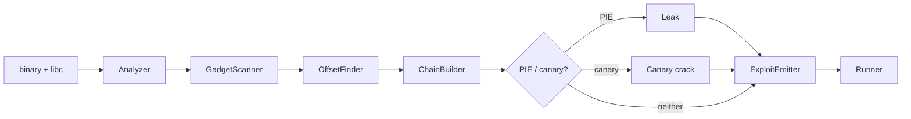

# rop-forge

An automated ROP-chain exploit generator for 64-bit Linux ELF binaries vulnerable to a stack buffer overflow. Given a binary (and optionally its libc), it detects enabled protections, scans for usable gadgets, computes the overflow offset, builds a working gadget chain via its own graph search, defeats ASLR/PIE and stack canaries where present, and emits a standalone, runnable exploit script.

Every algorithmic piece — gadget discovery, offset detection, chain construction, the leak primitive, the canary brute force — is implemented from scratch. `pwntools` is used as infrastructure (process/socket handling, ELF/corefile parsing, `cyclic()`), never as the solver: this project does not call into `pwntools.rop.ROP`, `angrop`, or `ropper`'s automated chaining.

> **Authorized use only.** All targets in this repository are self-compiled fixtures (`fixtures/src/vuln.c`), built specifically to demonstrate this tool. Do not point rop-forge at binaries or services you don't own or have explicit permission to test.

## What it defeats

| Tier | Protections | Fixture | Technique |
|---|---|---|---|
| 1 | none | `fixture1_none` | direct ROP chain |
| 2 | NX | `fixture2_nx` | ROP chain (shellcode injection blocked) |
| 3 | NX + canary | `fixture3_nx_canary` | canary brute force, then ROP chain |
| 4 | NX + PIE | `fixture4_nx_pie` | leak libc's base, then ROP chain |
| 5 | NX + PIE + canary | `fixture5_nx_pie_canary` | canary brute force **and** a leak, then ROP chain |

All five get a real shell, fully automated — no manual gadget hunting, no per-target special-casing.

## Pipeline



- **Analyzer** — parses the ELF to detect NX, PIE, RELRO, and stack canary.
- **GadgetScanner** — disassembles `.text` (binary and libc) with `capstone`, extracts and classifies gadgets (`POP_REG`, `MOV_MEM`, `SYSCALL`, `STACK_PIVOT`, …).
- **OffsetFinder** — sends a de Bruijn pattern (`pwntools.cyclic`), crashes the target, computes the exact offset to the return address from the resulting corefile.
- **ChainBuilder** — models chain construction as a BFS search over gadget-induced register-state transitions (`chainer/README.md` has the full design writeup).
- **Leak** — for PIE/ASLR targets: a forking-server harness where `fork()` never re-randomizes, so a real address leaked from one connection stays valid for a later connection to the same process.
- **Canary crack** — byte-by-byte brute force against the same forking server, using glibc's own `"*** stack smashing detected ***"` message as the oracle.
- **ExploitEmitter** — serializes the solved chain into a standalone script with no `rop_forge` dependency.
- **Runner** — `--run` executes the exploit live and confirms real command execution (checks for `id`'s own `uid=` output, not just "didn't crash").

## Quick start

```bash
# Tier 1-2: no PIE, no canary — one binary, one command
rop-forge fixture1_none --stage exploit --run

# Tier 3/4/5: PIE and/or canary — needs a forking-server variant of the
# same binary (fixtures/src/server_main.c); the tool auto-detects whether
# canary-cracking is needed
rop-forge fixture3_nx_canary --server fixture3_nx_canary_server --stage exploit --run

# Save the generated script instead of printing it
rop-forge fixture1_none --stage exploit --output exploit.py
```

Standalone stages for debugging (`--stage {analyzer,gadgets,offset,chainer,leak,canary,exploit}`) each print one fact and exit — e.g. `rop-forge <binary> --stage analyzer` just prints protection status. The bare `rop-forge <binary>` runs the cheap static stages (analyzer → gadgets → offset) by default; the chain builder is opt-in via `--stage`, since the libc gadget scan alone costs ~80s.

Full library API is the same surface the CLI calls — `rop_forge.analyzer.analyze_protections()`, `rop_forge.gadgets.scan_gadgets()`, `rop_forge.chainer.build_chain()`, `rop_forge.leak.probe()`, `rop_forge.canary.crack_canary()`, and so on.

## Requirements

Linux x86-64 only — `pwntools.process()` needs to fork/exec real ELF binaries, which is impossible on macOS or Windows regardless of packaging. Developed inside a Linux devcontainer on a macOS/arm64 host (see below); on native Linux, `uv sync` alone is sufficient.

```bash
uv sync
uv run pytest        # ~115 tests, real fixtures, real crashes, real shells
uv run rop-forge <binary> [--stage X] [--run]
```

## Two kinds of emitted exploit script

For the `aslr=False` tiers (1–2), the emitted script freezes the already-solved payload — genuinely reusable against any fresh spawn of that binary, since disabling ASLR makes the addresses permanent.

For the PIE/canary tiers (3–5), a frozen payload would only be valid against the exact process it was solved against — those addresses and the canary are randomized per process. So the emitted script instead **re-solves at runtime**: it bakes in only the structural facts (which gadgets, in what order, at what offset within libc; the stack offsets to the canary/return address) and re-cracks the canary and/or re-leaks libc's real base against a fresh spawn of the target every time it runs — using nothing but `pwntools`, no `rop_forge` import at all.

## Why not `angrop`/`ropper`?

Those are excellent, production-grade tools — this project deliberately doesn't use them as the solver, because reimplementing gadget discovery, offset detection, and chain search from scratch is the actual point of the exercise, not a means to an end. A few concrete differences worth naming:

- **Chain search** here is a plain BFS over a small, explicit register-state model (`chainer/README.md`), not a constraint solver — simpler, more limited, and fully inspectable; `angrop` uses symbolic execution (via `angr`) to reason about gadget side effects far more completely than this project's fixed pop/mov/syscall taxonomy does.
- **The leak and canary-crack primitives are hand-built** for this project's forking-server model (`fork()`-preserves-secrets), not general-purpose — `ropper`/`angrop` don't attempt live exploitation at all, only chain construction.
- **Scope is deliberately narrow**: x86-64 Linux, stack-overflow only, a fixed five-tier protection ladder. `angrop`/`ropper` are architecture- and mitigation-general by design.

## Project status

Phases 0–7 (of PRD.md's plan) complete: scaffolding, analyzer, gadget scanner, offset finder, chain builder, ASLR/PIE leak bypass, canary brute-force bypass, exploit emitter. See `PRD.md` for the full spec and `chainer/README.md` for the chain-search design writeup.
