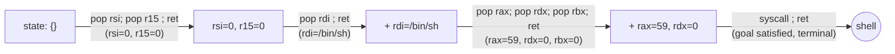

# Chain construction as a search problem

This is the core algorithmic contribution of the project (PRD.md §6.3) — a BFS over gadget-induced register-state transitions, not a constraint solver and not `pwntools.rop.ROP`/`angrop`. This note explains the model `builder.py` implements.

## State

A `ChainState` (`state.py`) is a snapshot of what the attacker currently controls:

- `registers` — a `frozenset` of `(register_name, value)` pairs: which registers currently hold which attacker-chosen values.
- `written` — a `frozenset` of addresses that have already had their required bytes written to memory.

Both fields are frozensets specifically so `ChainState` is hashable — the BFS's `visited` set relies on this for deduplication, which is what keeps the search tractable regardless of how many gadgets are available.

## Goal

A `Goal` (`goal.py`) is the target state: a set of required `(register, value)` pairs, plus any memory writes that must have happened, plus which kind of gadget must execute last (`SYSCALL`, for `execve`). `is_satisfied()` checks a `ChainState` against all three.

For `execve("/bin/sh", NULL, NULL)` (PRD.md §6.3's own worked example): `rax=59, rdi=&"/bin/sh", rsi=0, rdx=0`, then a `syscall` gadget. Two goal constructors exist — `execve_goal()` requires writing `"/bin/sh"` to a scratch address (Phase 4, when the string doesn't already exist anywhere convenient); `execve_goal_preexisting_string()` skips the memory-write requirement entirely (Phase 5+, since glibc already contains this exact string internally for `system()`/`popen()`).

## Transitions

Each gadget maps to a state transition:

- **`POP_REG`** gadgets (`pop rdi ; ret`, `pop rsi ; pop r15 ; ret`, …) set the popped register(s) to an attacker-chosen value — pulled from `pop_order`, the sequence of registers a `ret`-terminated gadget pops before returning.
- **`MOV_MEM`** gadgets (`mov [rdi], rsi ; ret`) write a chosen register's value to the address held in another chosen register — modeled via `mem_write = (dest_reg, src_reg, disp)`.
- The final `SYSCALL` gadget isn't a transition — it's the goal's own terminal step, appended once the rest of the state is satisfied.

Only `ret`-terminated gadgets carry `pop_order`/`mem_write` data at all: a `jmp reg`/`call reg`-terminated gadget doesn't consume the next stack value the way `ret` does, so treating it as a normal transition would silently produce a broken chain (see `gadgets/` — this is enforced at scan time, not chain-build time).

## Search

`build_chain()` runs a breadth-first search from the empty `ChainState` (`ChainState.initial()`) toward any state satisfying the goal, bounded to `max_depth` gadgets (default 8, per PRD.md §6.3). BFS guarantees the *shortest* valid chain is found first — not incidental, since a shorter chain is a smaller, more reliable payload.

Two things that would make the naive version of this intractable are handled before the BFS even starts, both found by hitting real hangs against libc (566 separate `pop rdi ; ret` instances alone) rather than anticipated up front:

1. **Redundant gadgets are deduped** to one representative per distinct `pop_order` (for pops) or `(dest_reg, src_reg, disp)` (for memory writes) — libc has hundreds of address-distinct, effect-identical gadgets.
2. **Memory-write gadget candidates are ranked and capped** (top 5, by register overlap with the goal) rather than folded all together — naively including every usable `mov`-gadget blows up the "relevant register" set for the *pop* gadgets too, since the search needs to consider values for whichever registers *any* mem-write gadget might need.

The state space that matters is small on purpose: since pop gadgets let the attacker choose the popped value freely, the search never explores "which value to pop" as a continuous choice — it only ever picks from the small set of goal-relevant constants (plus a `0` filler for registers a multi-pop gadget touches incidentally alongside a register we do care about).

## Known limitation: the top-5 cap is technically incomplete

If none of the top-5 ranked memory-write candidates leads to a full valid chain but some lower-ranked candidate would have, `build_chain()` raises `ChainNotFoundError` even though a valid chain exists elsewhere in the gadget database. This is a real, documented gap relative to a literal exhaustive BFS — and an explicit, PRD-sanctioned trade-off ("bound search... scope gadget database to a reasonable size; document the tradeoff rather than over-engineering a solution"), not an oversight. Unobserved as an actual problem across all five protection tiers so far; PRD.md §6.3 itself names the natural next step if it ever is one — upgrading to A* with a heuristic (e.g. number of unset goal registers), which would let the search reason about candidate quality *during* the search instead of pre-filtering before it starts.
